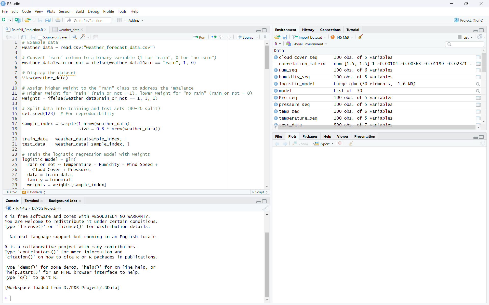
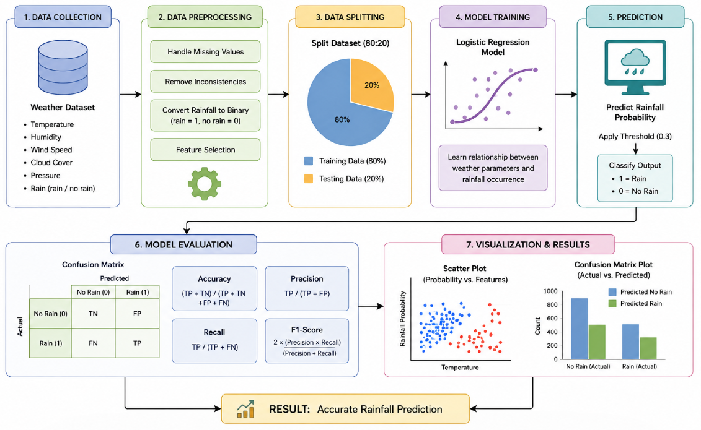
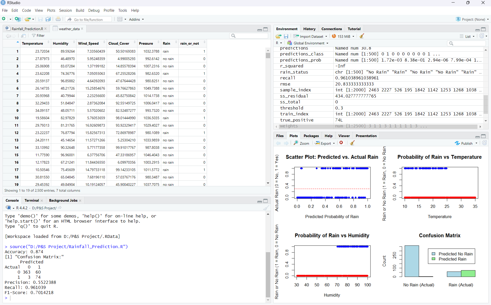
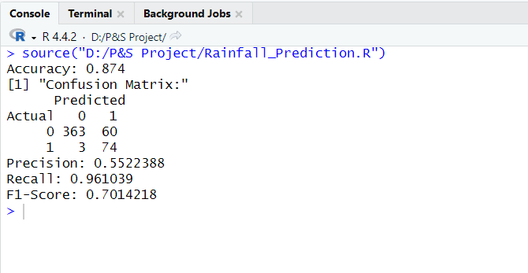
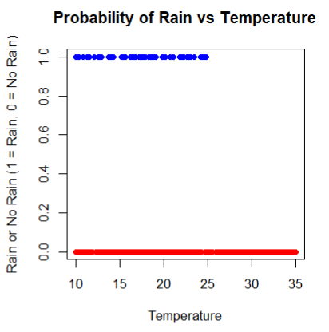
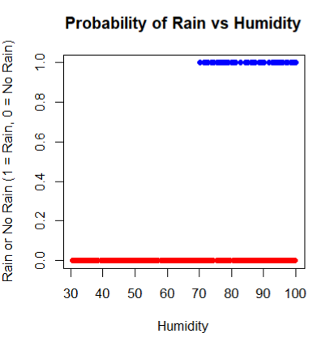
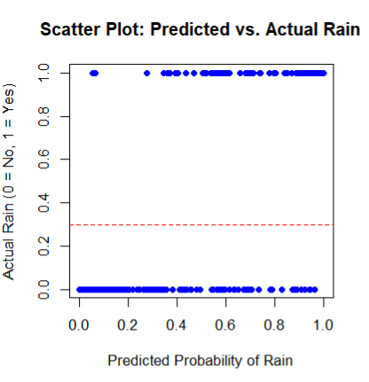
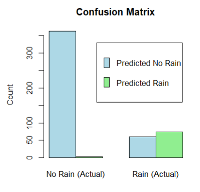

# Rainfall Prediction using Logistic Regression

  
  
  
  
  
  
  

> ### Probability and Statistics — VIT Chennai, November 2024
> **Joseph Alex Valluvassery**

---

## The Problem

Most traditional rainfall prediction systems rely on meteorological calculations, historical observations, or manual weather analysis. These approaches often struggle to accurately predict rainfall due to changing climate conditions and complex atmospheric patterns.

Rainfall forecasting is extremely important across agriculture, flood prevention, disaster management, and environmental monitoring systems. The real challenge is not just analyzing weather conditions — it is predicting rainfall occurrence accurately using weather parameters and historical data.

This project answers a different question than traditional forecasting systems:

> Not *“What does the weather look like?”*  
> But *“Based on weather conditions, will rainfall occur?”*

---

## What This Project Does

This project is a machine learning-based rainfall prediction system that:

1. Collects and analyzes historical weather data
2. Processes weather parameters using data preprocessing techniques
3. Uses Logistic Regression for rainfall classification
4. Predicts whether rainfall will occur based on weather conditions
5. Generates rainfall probability predictions from environmental data
6. Evaluates model performance using Accuracy, Precision, Recall, and F1-Score
7. Visualizes prediction results using scatter plots and confusion matrix analysis
8. Produces a complete rainfall prediction workflow using RStudio and Machine Learning

---

## How It Works

The system works using a machine learning workflow with multiple processing stages:

- **Data Collection Stage** — Loads historical weather data from CSV datasets

- **Preprocessing Stage** — Cleans the dataset and converts rainfall values into binary classes

- **Training Stage** — Trains the Logistic Regression model using weather parameters

- **Prediction Stage** — Generates rainfall probability predictions for testing data

- **Evaluation Stage** — Calculates Accuracy, Precision, Recall, F1-Score, and Confusion Matrix

Rstudio:

  

---

## Architecture

---

## Model & Technologies Used

| Category | Technology / Model |
|---|---|
| Programming Language | R |
| Development Environment | RStudio |
| Machine Learning Model | Logistic Regression |
| Prediction Type | Binary Classification |
| Dataset Format | CSV |
| Data Processing | Base R |
| Visualization | Scatter Plots, Confusion Matrix |
| Evaluation Metrics | Accuracy, Precision, Recall, F1-Score |
| Statistical Functions | `glm()` |
| Model Family | Binomial Logistic Regression |

---

## Features

- Historical weather data analysis
- Rainfall prediction using Logistic Regression
- Binary classification (Rain / No Rain)
- Weather parameter-based prediction system
- Data preprocessing and feature selection
- Threshold-based rainfall probability classification
- Accuracy, Precision, Recall & F1-score evaluation
- Confusion matrix generation and analysis
- Scatter plot visualization for rainfall trends
- Simple and efficient machine learning workflow

---

## Results

The rainfall prediction system was successfully developed and tested using Logistic Regression in RStudio with historical weather datasets.

The system demonstrated effective rainfall classification by analyzing weather parameters such as temperature, humidity, wind speed, cloud cover, and atmospheric pressure.

  

The trained model achieved:

- **Accuracy:** 87.4%
- **Precision:** 55.2%
- **Recall:** 96.1%
- **F1-Score:** 70.1%

The results showed strong rainfall detection capability with high recall performance, making the system suitable for weather forecasting and environmental analysis applications.

### Confusion Matrix:

  

### Visualization Results:

- Scatter Plot: Probability vs Temperature
  

  
  

- Scatter Plot: Probability vs Humidity
  

  
  

- Predicted vs Actual Rainfall Visualization
  

  
  

- Confusion Matrix Plot
  

  
  

The visualization outputs helped analyze rainfall probability patterns and evaluate overall model performance.

---

## Usage

1. Place both the following files inside the same project folder:

- `rainfall_prediction.R`
- `weather_forecast_data.csv`

2. Open the project folder in **RStudio**.

3. Run the R script:

- Go to **Sessions**, then **Set Working Directory** and select **Source File Location**
- Click on **Source**

4. The system will:

- Load the CSV weather dataset
- Preprocess the data
- Train the Logistic Regression model
- Predict rainfall probability
- Generate evaluation metrics
- Display visualization plots

---

## Author

- **Joseph Alex Valluvassery**

**School of Electronics Engineering**  
Vellore Institute of Technology, Chennai  
November 2024
